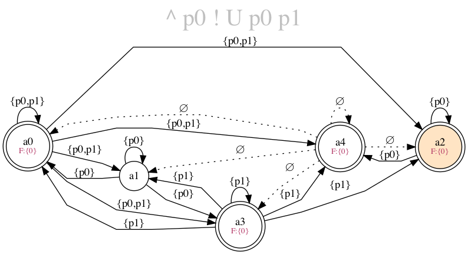

# LTL to Büchi conversion

************************

## Building project

Run from the root directory of the project.

```shell
> cmake -S . -B cmake-build
> cmake --build cmake-build --target ltl_converter
```

The binary will appear in the `cmake-build/bin/`.

### Requirements

- compiler with __C++20__ standard support
- [CMake](https://cmake.org/) >= 3.19 version
- [Graphviz](https://graphviz.org/) open-source graph visualization software

************************

## IO description

### Input format for LTL-formula

Read LTL-formula in Polish notation from standard input.

__Propositional operators__
- _fi_ ::= 't' # constant true
- _fi_ ::= 'p'[0-9]+ # proposition
- _fi_ ::= '!' _fi_	# negation
- _fi_ ::= '^' _fi_ _fi_ # conjunction
- _fi_ ::= [ \t\n\r\v\f] _fi_ # white space is ignored
- _fi_ ::= _fi_ [ \t\n\r\v\f] # white space is ignored

__Temporal operators__
- _fi_ ::= 'X' _fi_ # next
- _fi_ ::= 'U' _fi_ _fi_ # until

Pass formula into the executable file (_ltl_converter_) via standard input.
`cat test.txt | ./ltl_converter` - as an example.


### Output automaton

Output will be saved into the (hardcoded) __dot.gv__ file in a dot-language format.
See more [here](https://graphviz.org/doc/info/lang.html) to understand main principles.

Also, will be printed detailed explanation of each a_i state into the standard output.

### Graphical representation
You may need __graphviz__ package to visualise dot language.
The default example of usage is a __run.sh__ file (Run it in a bash terminal: `bash run.sh`).

_Note:_ run main program before to generate appropriate dot file.

### Usage example

LTL-formula for the input: `^ p0 ! U p0 p1` is equal to the `f = p0 ^ ¬(p0 U p1)` common mathematical representation.

__Standard output:__
```shell
> echo "^ p0 ! U p0 p1" | ./ltl_converter
a0 = {p0; p1; U p0 p1; ! ^ p0 ! U p0 p1}
a1 = {p0; ! p1; U p0 p1; ! ^ p0 ! U p0 p1}
a2 = {p0; ! p1; ! U p0 p1; ^ p0 ! U p0 p1}
a3 = {! p0; p1; U p0 p1; ! ^ p0 ! U p0 p1}
a4 = {! p0; ! p1; ! U p0 p1; ! ^ p0 ! U p0 p1}
```

__Graphical representation:__

Build png-image from the generated dot-language graph representation in the _dot.gv_ file.
```shell
> dot -Tpng -o automaton.png dot.gv
```

Shorthanded script for bash:
```shell
> bash run.sh
```



************************

## Theory

### Bibliography

1. _Javier Esparza_: __Automata theory. An algorithmic approach.__ September 24, 2019:
   Constructing the NGA for an LTL formula: p. 309
2. _Кривий С.Л._ __Скінченні автомати: теорія, алгоритми, складність.__ "Букрек" 2020:
   Верифікація систем: p. 277-294

The second source is used as the main one.
Esparza proposes another algorithm for constructing atomic pluralities (Automaton states generating).

************************

[**GitHub Repository**](https://github.com/maxs-im/LTL_to_NGA)
